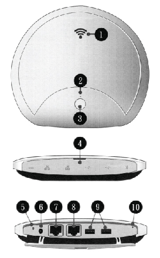

|  | Caracteristiques |
|------------------------------------|------------|
| Connectivité Wifi | 802.11ac (5ghz) & 802.11n (2.4Ghz) |
| Portée du réseau Wifi | 5Ghz : **10m**, 2.4Ghz: **30m** |
| Capacités du réseau Wifi | ~10 à 15 connexions simultanées pour du  streaming vidéo, 30 en temps normal |
| Stockage | 16Go eMMC pour le système d'exploitation + disque dur de 500Go pour les données (`WD Blue WD5000LPCX`) |
| Batterie | Jusque 7 heures d'autonomie. 5-6 heures de chargement (lorsque le serveur est éteint). |
| Dimensions & poids | 208.7 * 184.5 * 30.5 mm, poids : 655g |
| Processeur | Intel SOC Celeron : N3350/N3450 |
| Mémoire | DDR3L RAM 2GB |
| Connectique | 1 DC-in jack (40) 2 x USB 3.0 port 2 x GB LAN |
| Système d'exploitation | Ubuntu 14.04 |
| Alimentation | 100 - 240V, 24W |
| Robustesse | Test de chute de 70cm (power off), IP54 |

---

| Signalétique & boutons | Description |
|--|--|
|| 1. Voyant lumineux du hostspot Wifi 2. Voyant lumineux de l'alimentation 3. Bouton marche / arrêt (Pression de 4s pour allumer, pression de 1s pour lancer le processus d'extinction) 4. I/O cabnit 5. Indicateur lumineux de l'alimentation 6. BRanchement d e l'alimentation 7. Port RJ45 pour connection réseau 8. Port non utilisé 9. Port USB 3.0 9. Port non utilisé  |

