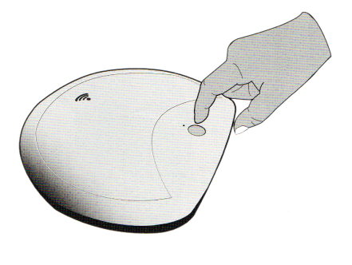

* **Allumer** : Allumez l'appareil en appuyant sur le bouton **Power pendant 4s**, l'appareil et le hotspot wifi seront entièrement sous tension lorsque la LED wifi s'allumera, cela prend généralement 2 min environ.
* **Éteindre** : Eteignez l'appareil en appuyant sur le bouton **power pendant 1s** (le processus d'arrêt suivra et l'appareil s'arrêtera peu après)