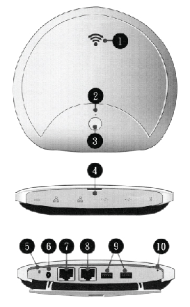

An internet connection allows for software and contents update.

It also allows for remote supprot from the BSF tech team.

1. Connect an Ethernet (RJ45) cable to port 7 (see picture)
2. Ensure the device is powered on

At this point, the LEDs around the ethernet port should be lit (both green and yellow).

