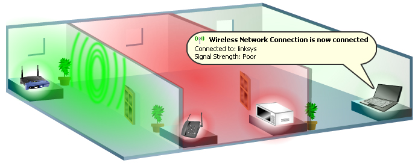

*This picture illustrate and show how the Ideascube location is important.* 

* Users in the **green zone** will get most of the signal strength and throughput
* Users in the **red zone** will get a poorer signal especially if any other electronic devices are present in the room. Wall composition can have some bad effect especially in case of reinforced concrete
* The third room will get none or really poor wifi signal, usually it is not usable even if the hot spot can be "seen" by the device

In free zone, Ideascube coverage on 5 Ghz wifi hot spot will be around 10-15 meters, it should be more on 2.4 Ghz with a coverage of 30 meters

A [Wifi repeater](https://en.wikipedia.org/wiki/Wireless_repeater) can be use to extend to few more meters (usually 10-30 meters) the Ideascube wifi signal