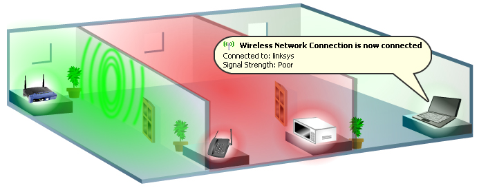

*This picture illustrate and show how the Ideascube location is important.* 

* Users in the **green zone** will get most of the signal strength and throughput.
  * They will be able to connect on idc-xxx-xxx-xxx-**2.4Ghz** and idc-xxx-xxx-xxx-**5Ghz**
* Users in the **red zone** will get a poorer signal especially if any other electronic devices are present in the room. Wall composition can have some bad effect especially in case of reinforced concrete
  * They will be able to connect on idc-xxx-xxx-xxx-**2.4Ghz** but idc-xxx-xxx-xxx-**5Ghz **will have a bad signal if exist
* The **third room** will get none or really poor wifi signal, usually it is not usable even if the hot spot can be "seen" by the device
  * Users will see no signal at all or really poor signal on idc-xxx-xxx-xxx-**2.4Ghz**. idc-xxx-xxx-xxx-**5Ghz **will not be visible

In free zone, Ideascube coverage on 5 Ghz wifi hot spot will be around 10-15 meters, it should be more on 2.4 Ghz with a coverage of 30 meters

> > > > Ideascube must be positioned vertically with it mounting plate provided in the package. The front part (white one) must be pointed in direction of the users

> > > > Do not place the device in a metal box. Wifi signal will be significantly degraded

> > > > Dot not place the device behind a wall

> >>>> **Older devices** does not have 5Ghz feature so they will connect only through 2.4Ghz hotspot. **Recent devices** will have the 5Ghz feature, so if the user is close to the wifi hotspot it might be interesting to use it as the throughput is higher. 

A [Wifi repeater](https://en.wikipedia.org/wiki/Wireless_repeater) can be use to extend to few more meters (usually 10-30 meters) the Ideascube hotspot signal