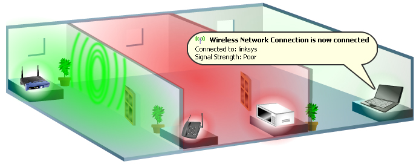

*Cette image illsutre l'importance de l'emplacement de l'ideascube pour la connexion.* 

* Les utilisateurs situés dans la **zone verte** obtiendront la majeure partie de la puissance du signal et du débit.
  * Ils pourront se connecter sur les réseaux idc-xxx-xxx-xxx-**2.4Ghz** et idc-xxx-xxx-xxx-**5Ghz**
* Les utilisateurs situés dans la **zone rouge** obtiendront un signal plus faible, surtout si d'autres appareils électroniques sont présents dans la salle. Les matériaux composant les murs peuvent avoir un effet néfase sur le signal, surtout dans le cas de murs en béton armé
  * Ils pourront se connecter sur le réseau idc-xxx-xxx-xxx-**2.4Ghz** mais le réseau idc-xxx-xxx-xxx-**5Ghz **aura un mauvais signal
* La **troisième pièce** ne recevra qu'un faible signal voire pas de signal du tout. Il n'est pas utilisable même si le nom du réseau wifi peut être "vu" par l'appareil
  * Les utilisateurs ne verront aucun signal ou un signal très faible sur le réseau idc-xxx-xxx-xxx-**2.4Ghz**. Le réseau idc-xxx-xxx-xxx-**5Ghz **ne sera pas visible

> >>>> **Les anciens appareils** ne sont pas en capacité de capter un signal wifi sur la fréquence 5Ghz. Lls ne se pourront se connecter qu'en utilisantle  réseau wifi de 2,4Ghz. **Les appareils récents** peuvent eux se connecter sur lae réseau 5Ghz. Si l'utilisateur est proche du hotspot wifi, il peut être intéressant de l'utiliser car le débit est plus élevé. 

En zone libre, la couverture du réseau wifi 5 Ghz de l'Ideascube est  d'environ 10-15 mètres. Le réseau wifi 2,4 Ghz a une portée plus importante (mais un débit inférieur) et eut couvrir une zone de  30 mètres de diamètre.

> > > > L'Ideascube doit être positionné verticalement avec sa plaque de montage fournie dans l'emballage. La partie avant (blanche) doit être orientée en direction des utilisateurs

> > > > Ne pas placer l'appareil dans une boîte métallique. Le signal Wifi sera fortement dégradé

> > > > Ne pas placer l'appareil derrière un mur

Un [répéteur Wifi] (https://en.wikipedia.org/wiki/Wireless_repeater) peut être utilisé pour étendre le signal et la portée du réseau wifi à une dizaine de mètres supplémentaires (généralement 10-30 mètres de plus).