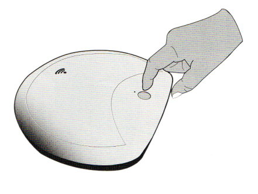

* **Power ON** : Turn on by pressing the **power button for 4s**, the device and the wifi hotspot will be fully power up when the wifi LED will light, it usually take 2 min or so.
* **Power OFF** : Turn off by pressing the **power button for 1s** (the stop process will follow and the device will stop shortly after)

> >>>> **Please note** that shutting down the device is not available anymore from the Ideascube software website