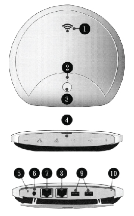

An update of each application and content if available can be perform remotely.

1. Connect an Ethernet (RJ45) cable to port 7 (see picture)
2. Press power button 3 for 4 seconds
3. Update process will be performed automatically

