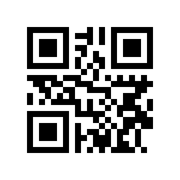
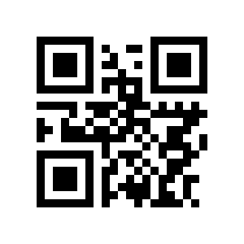
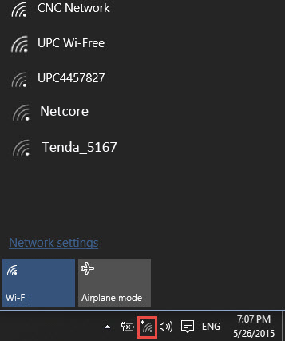

## Android

> > > > Recent Android smartphone (only smartphone) try to **always** be connected to a network providing Internet access. If the network they are connected on does not provide any Internet access they will automatically switch back over data connexion (2G/3G/4G Internet connexion). The user will have then great difficulties to stay connected on the Ideascube wifi hotspot.
> > > >
> > > > In that case, please disable the data connexion before connecting to the Ideascube wifi hotspot

## Turn on & connect

1. Open your device's Settings app .
2. Tap **Network & internet**  **Wi-Fi**.
3. Turn on **Wi-Fi**.
4. Tap one of the wifi network idc-xxx-xxx-xxx-2.4Ghz or idc-xxx-xxx-xxx-5Ghz
5. Once connected the captive portal will redirect you towards the Ideascube software landing page.
6. If for any reason this page close, open your favorite web browser
   * In the URL bar : write down http://ideascube or http://ideasbox
   * Click the star to save the URL as favorite for future connexion

**Tip:** You can also swipe down on your screen to get to Wi-Fi settings

## QR Code 

For faster connexion you can flash these QR Code. 

> > > > You can download [Barcode Scanner app](https://f-droid.org/repo/com.google.zxing.client.android_108.apk) to flash these QR Code. [Details of the app](https://f-droid.org/fr/packages/com.google.zxing.client.android/)

http://ideasbox

http://ideascube

## Windows 

1. Enable wifi from button key on your keybord or from wifi icon on your task bar.
2. Select the appropriate wifi network idc-xxx-xxx-xxx-2.4Ghz or idc-xxx-xxx-xxx-5Ghz. Use **5Ghz** network if you can see the Ideascube hardware (usually mounted on a wall or laying on a table), otherwise use **2.4Ghz** network
3. Open your favorite web browser and type the following URL : http://ideascube or http://ideasbox
4. Save the website as favorite for future connexion

